# Laboratorio git

## 1. Crear un repositorio en local

Abre tu terminal y navega hasta el directorio donde deseas crear el repositorio.

Crea una carpeta con el nombre del repositorio.

Ingresa a la carpeta que acabas de crear.

Inicializa el repositorio de Git.

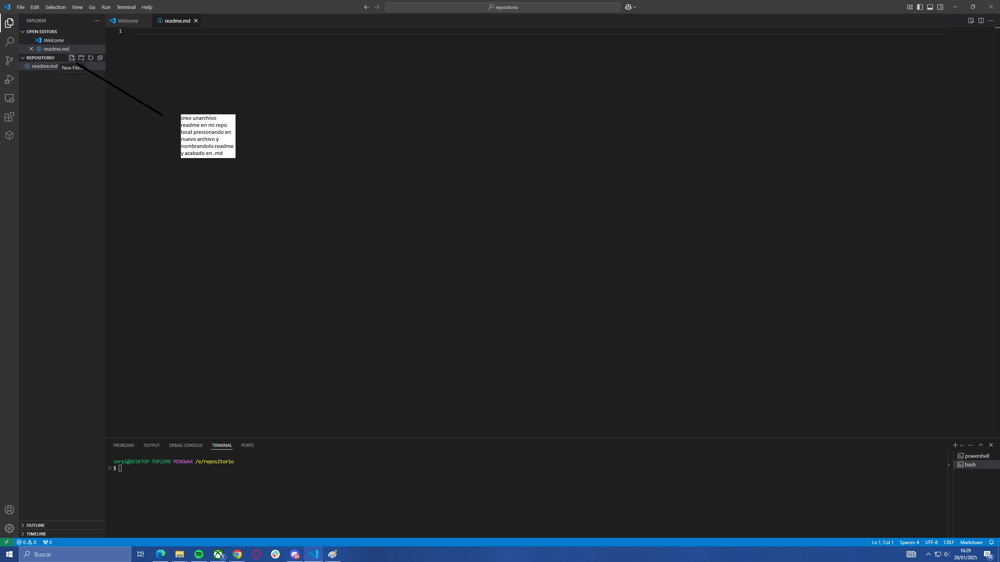 
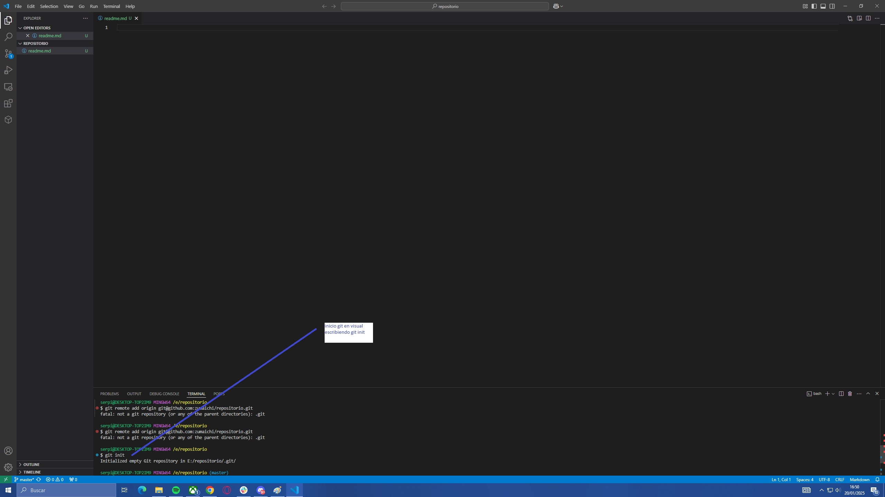
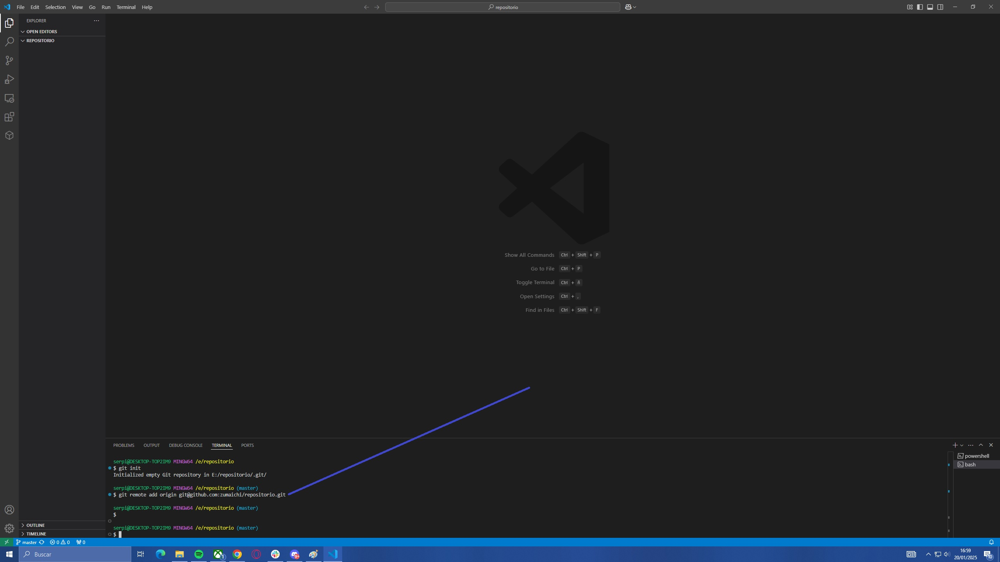  
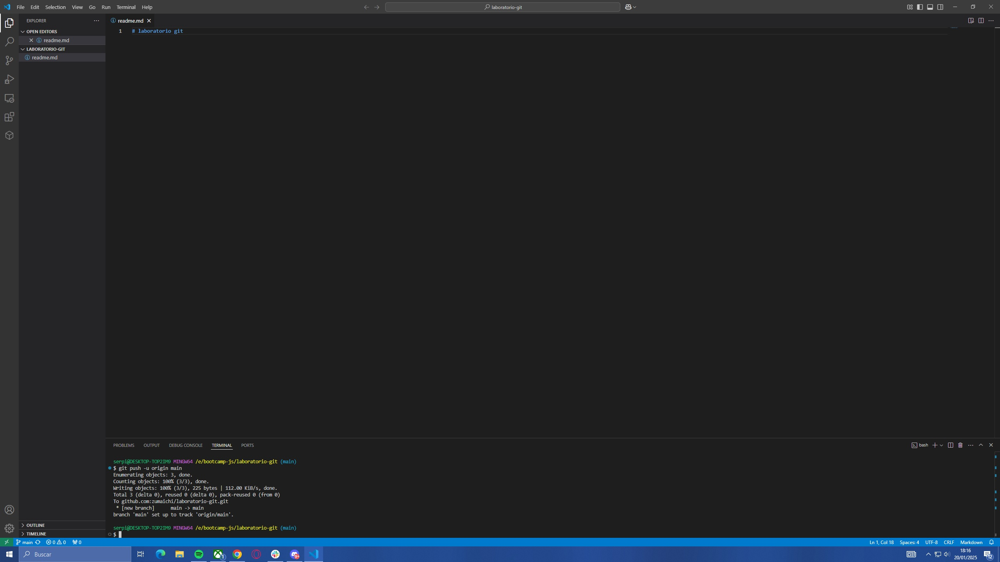

## 2. Subir el repositorio a GitHub

Crea un nuevo repositorio en GitHub.

Copia el URL del repositorio que acabas de crear en GitHub.(copiamos la dirccion shh del repositorio en la web de git)

Conecta tu repositorio local con el repositorio en GitHub.(para conectar escribimos en la consola de bash "git remote add origin y aqui añladimos la direccion shh copiada anteriormente" y seguidamente para subirlo escribimo "git push -u origins master")

Verifica que la conexión se haya establecido correctamente.

no se por q he perdido capturas, pero no encuentro las capturas del hacer el push a git, lo explico juntocada punto los pasos q me faltan capturas (si recuerdas esta parte la hicimos juntos varias veces )

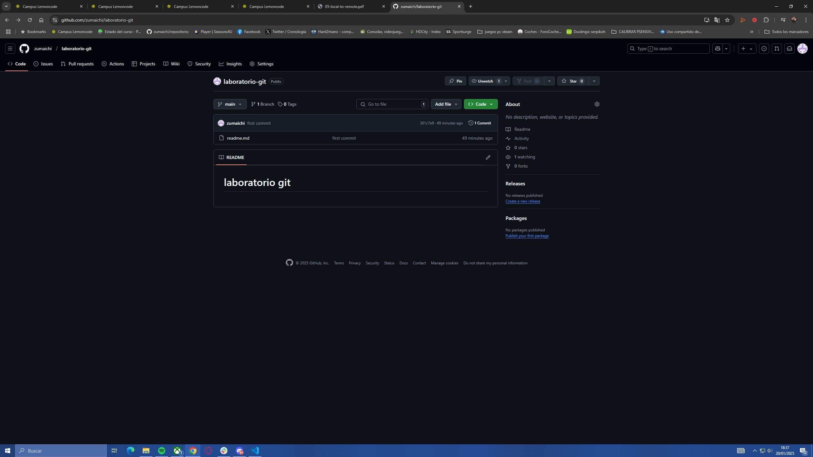  
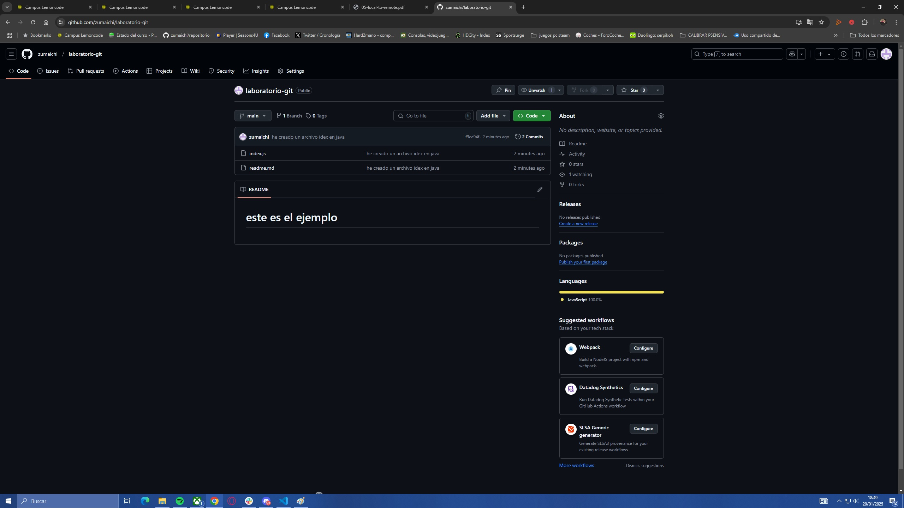

## 3. Hacer un commit y un push

Crea un archivo en la carpeta del repositorio. (creamos un archivo pulsando rn rl icono del folio con una hoja doblada en el explorer de visiual en la carpeta q lo queremos crear,el que cree se llama index y es java)

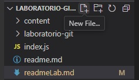

Añade el archivo al staging.(scribimos git add .)

Crea un commit con un mensaje descriptivo.(creamos escibiendo en la consola "git commit -m" y entre comillas nuestro comentario)

Sube los cambios al repositorio en GitHub.(escribir en la consola git push)

## 4. Crear una rama

Crea una rama nueva llamada "development".

Cambia a la nueva rama.

Realiza algunos cambios en el archivo que creaste.

Añade y haz un commit con los cambios en la rama "development".

Sube los cambios a Github.

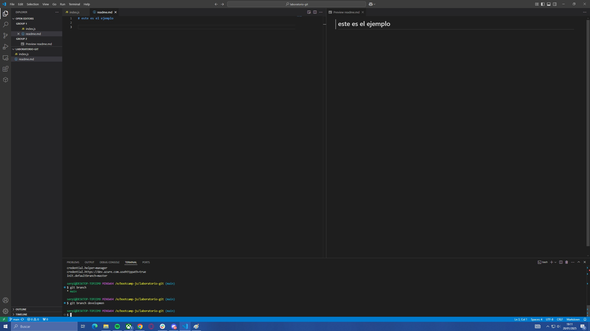
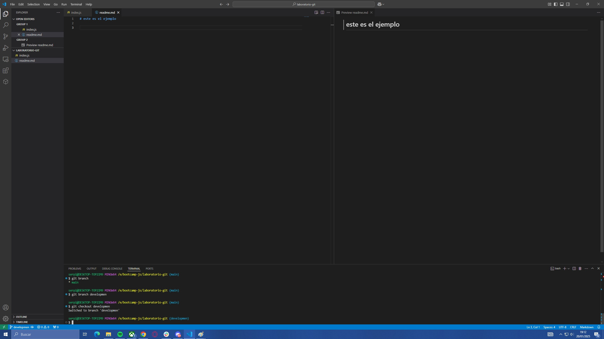
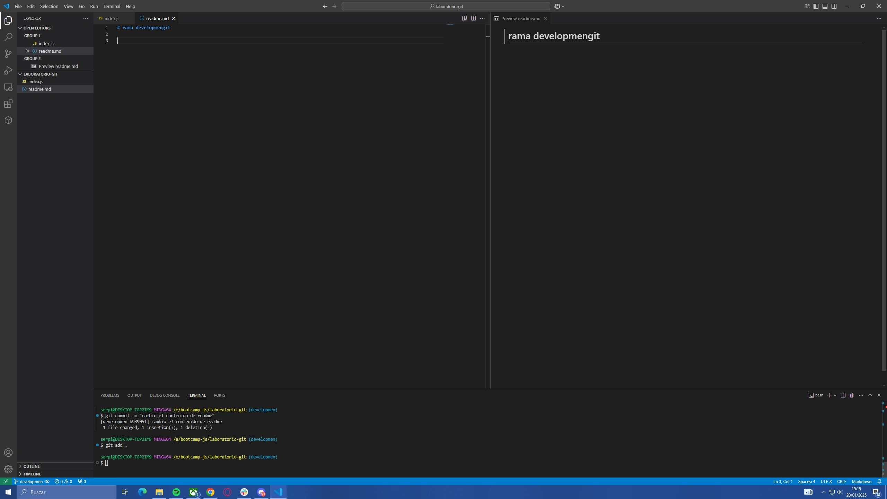

## 5. Hacer un merge

Vuelve a la rama "main".

Haz un merge de la rama "development" a la rama "main".

Si no hay conflictos, los cambios realizados en la rama "development" se incorporarán a la rama "main".

Hax un push de los cambios al repositorio en GitHub.

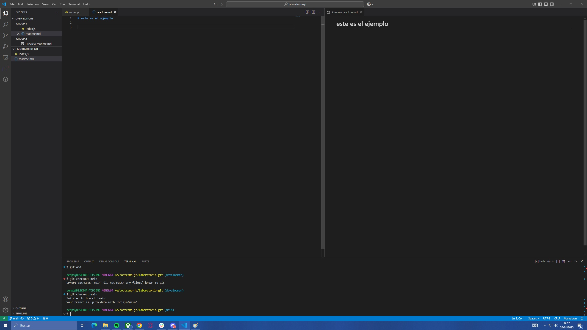
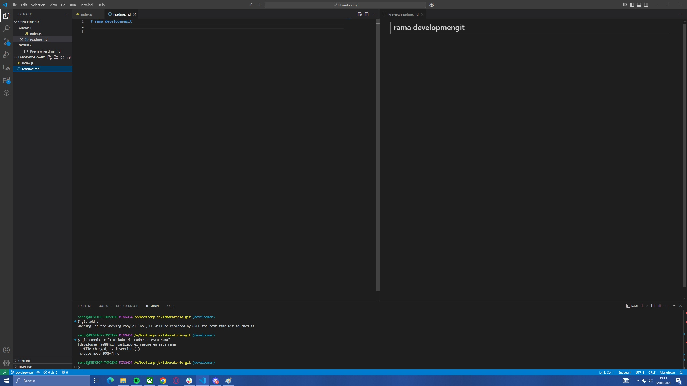
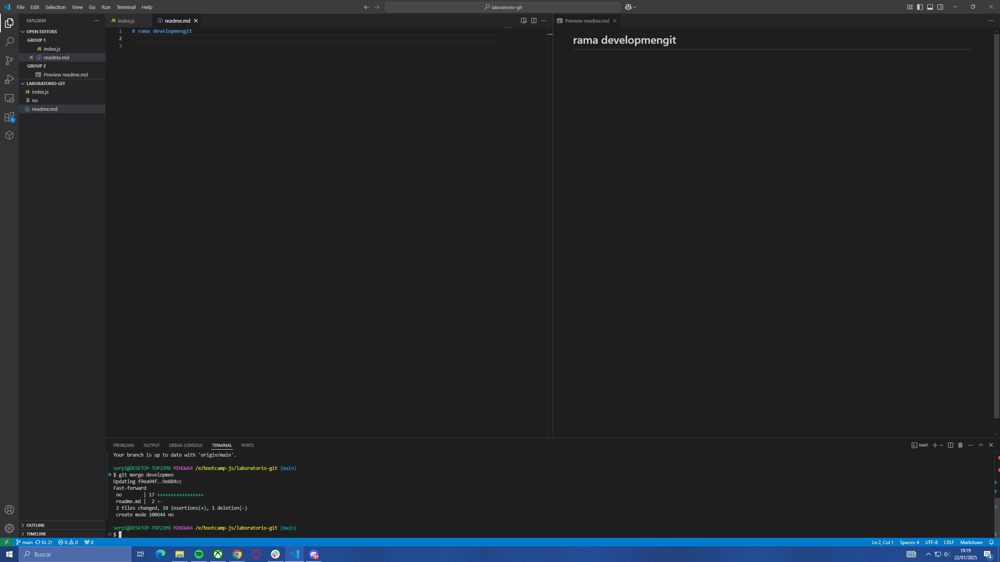
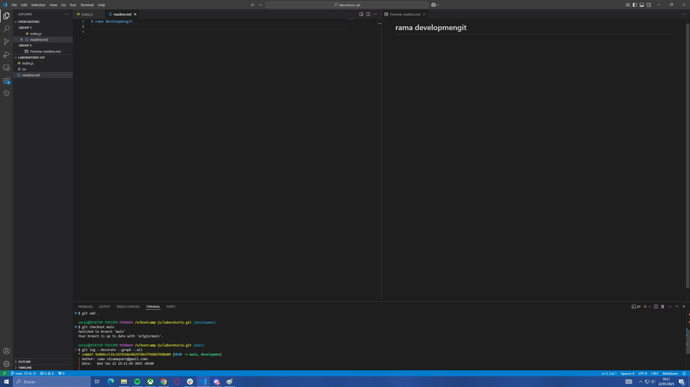     
   